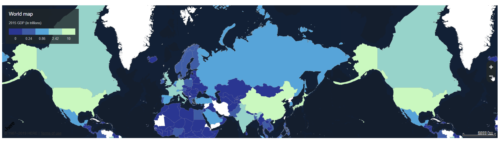

# The Task

There are a lot of data sources over the web. In Russia we have a list of gov. services, backed by the municipal, public authorities, big companies etc.
Some of the examples are:
 - Открыте даннные России https://data.gov.ru/
 - Проект "Открытые НКО" https://openngo.ru/
 - Хаб открытых данных https://hubofdata.ru/
 - Росстат http://www.gks.ru/
 - Федстат https://www.fedstat.ru/

**The idea of the project** - to provide a better visualizatio of the publicitl available data, suggest mechanim how to incorporate these data into administrative portals. Need to achieve 'Call to Action' mass effect. This was stated as one of the exercise for the Hackathon [Цифровой Прорыв](https://xn--b1aaqfxbbhefb3bya5f.xn--p1ai/)

This task 

# R&D completed

## Used Dataset
We are interested in Ecology & Healthcare domain.
Thus a preliminary investigation was done. Unfortunatelly the data is messy, not structered, even within the same provider it has a huge number of different formats.

Some sites provide their own notations for data (e.g. data.gov.ru), it has a self-described format.

## Surprises
 - Some services don't provide public API (https://www.fedstat.ru/), you can either download these data or ou should ne inside the restcited network to gain access to it.
 - No layered diagrams out of the box

## Russian polygons in geojson

## Working with layered maps

### Here Maps

https://developer.here.com/api-explorer-examples/lens-template-v-1-2-3/examples/choropleth-country-gdp-geojson/
Here Maps provides very nice design out-of the box. It even has very good examples on how to prepare a layer with countries colored. Unfortunatelly we faced with issues:
 - There are no polyfils

### Geovizualization

### Here XYZ

Here maps provides a cloud-based tool for developing geo-based applications

**Note**: Later experts from Here gave us a hint - we should not treat 

# Solution

## Features
 - [x] Enable Map visualization
 - [x] geojson for Russia
 - [x] mobile app
 - [ ] Easy intergartion with services

## Business solution

## Architecture

# Achiviements
 - Open Source. Solution is based on 
 - geojson for Russia 