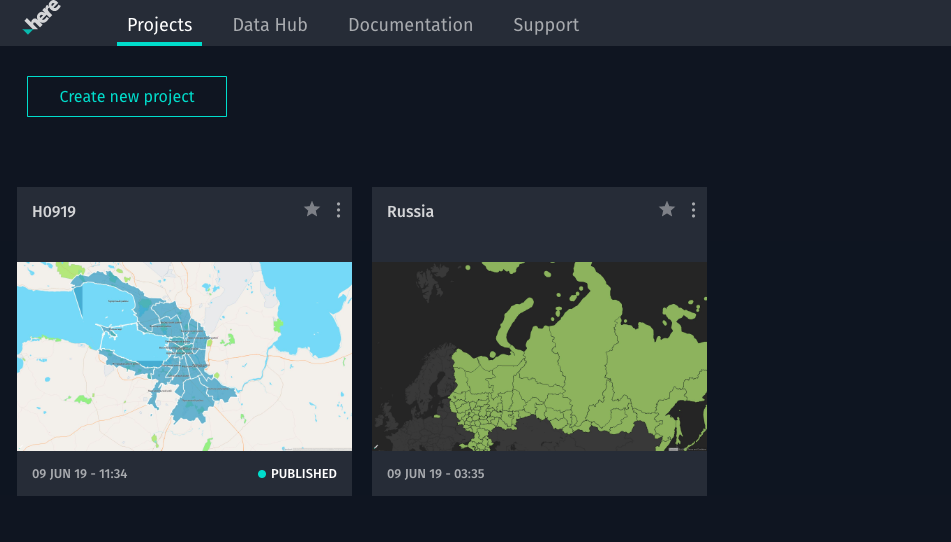
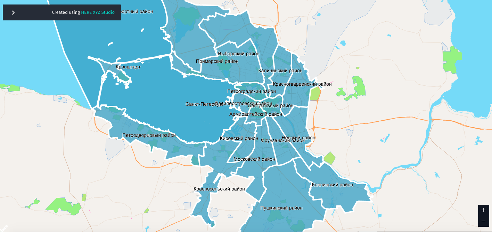

# The Task
====================

There are a lot of data sources over the web. In Russia we have a list of gov. services, backed by the municipal, public authorities, big companies etc.
Some of the examples are:
 - Открыте даннные России https://data.gov.ru/
 - Проект "Открытые НКО" https://openngo.ru/
 - Хаб открытых данных https://hubofdata.ru/
 - Росстат http://www.gks.ru/
 - Федстат https://www.fedstat.ru/

**The idea of the project** - to provide a better visualizatio of the publicitl available data, suggest mechanim how to incorporate these data into administrative portals. Need to achieve 'Call to Action' mass effect. This was stated as one of the exercise for the Hackathon [Цифровой Прорыв](https://xn--b1aaqfxbbhefb3bya5f.xn--p1ai/)

This task 

# R&D section
====================

## Used Dataset
We are interested in Ecology & Healthcare domain.
Thus a preliminary investigation was done. Unfortunatelly the data is messy, not structered, even within the same provider it has a huge number of different formats.

Some sites provide their own notations for data (e.g. data.gov.ru), it has a self-described format.

## Surprises
 - Some services don't provide public API (https://www.fedstat.ru/), you can either download these data or ou should ne inside the restcited network to gain access to it.
 - No layered diagrams out of the box

## Russian polygons in geojson

## Working with layered maps

### Here Maps

https://developer.here.com/api-explorer-examples/lens-template-v-1-2-3/examples/choropleth-country-gdp-geojson/
Here Maps provides very nice design out-of the box. It even has very good examples on how to prepare a layer with countries colored. Unfortunatelly we faced with issues:
 - There are no polyfils

### Here XYZ

Here maps provides a cloud-based tool for developing geo-based applications

**Note**: you should consider XYZ for the following usecases only (from out perspective):
 1. XYZ as a datastore. It can handle you geo- data, it can query the maps, it can provide an access to the objects (on the layers) by access tokens. So it seems to be a very handy to manage the data, when you incorporate it into another app
 2. XYZ as a RAD tool (= rapid appliaction development). It produces really beautiful apps, with no code at all, or avery little usage of it.

### Here Geovizualization
There are several techniques how to vizualize the regions/polygons.
// TBD
We were able to add polygons with St. Petersburg disctricts using XYZ studio. It works fine. But it was not satisfied out needs:
 1. you cannot control the color of the individual polygin on the sme layer
    - --> but you can place every polygon on its own layer and then colorize the layer
 2. if you need to interact 

Other options to consider: https://tcs.ext.here.com/examples/v3/admin_boundaries_batch

### Custom polygons for St. Petersburg
Finally we developed our owns polygon layers for Russia territories. This is geojson, that can be used with Here XYZ, or Here js api.
Looks good:

# Results & Solution
===================

## Features
 - [x] Enable Map visualization
 - [x] geojson for Russia
 - [x] mobile app
 - [ ] Easy intergartion with services

## Business solution

## Architecture

# Achiviements
 - Open Source. Solution is based on 
 - geojson for Russia 